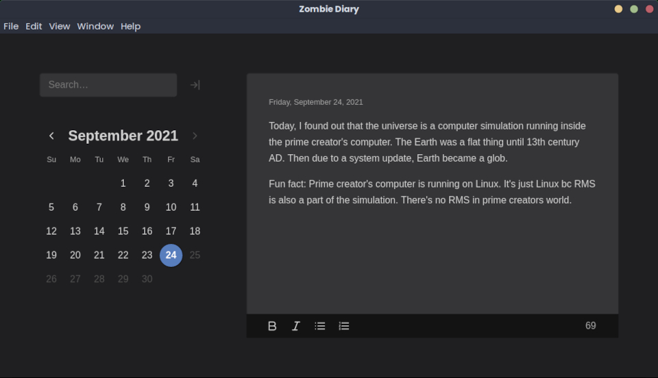

<!-- @format -->

 

  <h1>Zombie Diary</h1>
  
   

 

**Zombie Diary is a simple, secure and attractive journal app. Writing a journal is fun and 
enjoyable with Zombie Diary. Share your life stories with Zombie Diary. No matter how sensitive,
emotional or private they are, Zombie Diary will keep them as a secret. More importantly, Zombie 
Diary is completely open source, no secrets in the code. No hidden backdoors, telemetry or spyware. 
Zombie Diary is the most trustworthy friend you will ever find.**

### Features

+ Free and Open Source
+ Light and Dark themes
+ Text Formatting
+ Full Text Search
+ Statistics

### Background story

Samuel Meuli, a skillful software developer created a great journal app called Mini Diary. His Mini 
Diary software had many users and good contributors. I was also a big fan of that app. I used it and 
I loved it. Unfortunately, Mini Diary author, Samuel Meuli stopped further development of the 
project and marked the project as archived.

I was not ready to give up using Mini Diary. I don't want to let Mini Diary die. So I forked the 
Mini Diary project and that's the birth of Zombie Diary. The beautiful, attractive interface you see 
is from the Mini Diary author, Samuel Meuli. My target is to maintain this project as closely as 
possible to the Mini Diary project.  

**I don't have any connection with Mini Diary developers. I'm just a fan of Mini Diary project.**

So now you know how Zombie Diary project was made, but why I name the project as Zombie Diary? Well,
project Mini Diary is dead but this project, Zombie diary is not. Zombie Diary is live. What do you 
call a man who exist in real world but also dead? Zombie? 

[Mini Diary Project](https://github.com/samuelmeuli/mini-diary) \
[Mini Diary website by samuelmeuli → minidiary.app](https://minidiary.app)

## Development

The application is built with Electron and React. To run or build the app yourself, you'll need to
have Node.js and Yarn installed.

### Running the app

1. Clone this repository: `git clone REPO_URL`
2. Navigate into the project directory: `cd zombie-diary`
3. Install the dependencies: `yarn`
4. Run the app: `yarn start`

### Building the app

After cloning the repo and installing the dependencies, run `yarn dist`. The packaged app can be 
found in the `dist` folder.

## Contributing

### Features and Bugs

Suggestions and contributions are always welcome! Please first discuss changes via issue before 
submitting a pull request.

### Adding missing translations

The list of all English strings can be found in [`en.ts`](./src/main/i18n/translations/en.ts). If 
there are translations missing for your language and you'd like to help with the translation, you 
can add the translated strings to your language's file in 
[`src/main/i18n/translations`](./src/main/i18n/translations) and submit a PR.

### Adding a new language

If the app isn't translated into your language yet and you'd like to help out, you can easily add 
translations with the following steps:

1. The translation files can be found in [`src/main/i18n/translations`](./src/main/i18n/translations). 
Duplicate the [`en.ts`](./src/main/i18n/translations/en.ts) file as `[LANG].ts`, where `[LANG]` is 
the [shortcode of your language](https://electronjs.org/docs/api/locales).
1. In the file you just created, replace the English translations with your own.
1. Import your file in the `ALL_TRANSLATIONS` object in [`src/main/i18n/i18n.ts`](./src/main/i18n/i18n.ts).
1. Add your language shortcode to the `electronLanguages` array in [`package.json`](./package.json).
1. Run the app in your language (see the steps [above](#development)) and make sure that the 
translations fit into the app (e.g. that they aren't too long for input fields).
1. Submit a PR. Thanks for your help!

## Very Important

If you love this project, then you should be thankful to the Mini Diary project author and other 
contributors. Without them, You won't be able to use Zombie-Diary.

[Samuel Meuli's Github Account](https://github.com/samuelmeuli)
